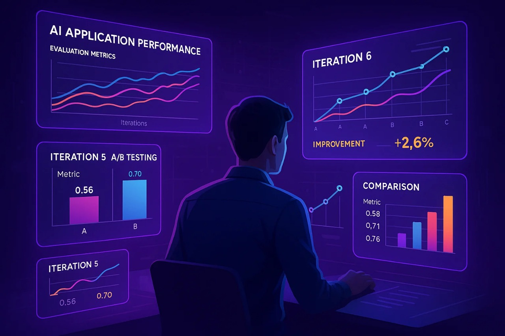

# InnoFlow - AI Workflow Automation Platform


InnoFlow is a comprehensive AI workflow automation platform that enables users to create, manage, and execute sophisticated AI-powered workflows through an intuitive visual interface. Built with modern technologies, InnoFlow bridges the gap between complex AI capabilities and user-friendly workflow management.

## 🚀 Project Overview

InnoFlow empowers users to design complex AI workflows using a drag-and-drop interface, connecting various AI models, data sources, and processing nodes to create powerful automation pipelines. Whether you're building chatbots, data processing pipelines, content generation systems, or multi-agent AI workflows, InnoFlow provides the tools and infrastructure you need.

### Key Capabilities




- **Visual Workflow Builder**: Drag-and-drop interface for creating complex AI workflows
- **Multi-AI Provider Support**: Integration with OpenAI, Google Gemini, Anthropic Claude, DeepSeek, HuggingFace, and Ollama
- **Real-time Execution**: Execute workflows with real-time monitoring and feedback
- **Extensible Architecture**: Plugin-based system for adding new AI providers and node types
- **User Management**: Complete authentication and authorization system
- **Analytics & Monitoring**: Track workflow performance and usage analytics
- **API-First Design**: RESTful APIs for programmatic access to all features

## 🏗️ Architecture

### Frontend (Next.js)
```
frontend/
├── app/                    # App router pages
│   ├── dashboard/         # Main dashboard interface
│   ├── auth/             # Authentication pages
│   ├── docs/             # Documentation system
│   └── api/              # API routes
├── components/           # Reusable React components
│   ├── flow/            # Workflow editor components
│   ├── auth/            # Authentication components
│   ├── dashboard/       # Dashboard components
│   └── ui/              # UI component library
└── hooks/               # Custom React hooks
```

### Backend (Django)
```
backend/
├── InnoFlow/
│   ├── ai_integration/   # AI providers and models
│   ├── workflows/        # Workflow management
│   ├── users/           # User management
│   └── analytics/       # Analytics and monitoring
└── requirements.txt     # Python dependencies
```

## ✨ Features

### 🎨 Visual Workflow Editor
- **Drag & Drop Interface**: Intuitive node-based workflow creation
- **Real-time Canvas**: Live workflow visualization and editing
- **Node Library**: Comprehensive collection of AI and utility nodes
- **Connection Management**: Visual connections between workflow nodes
- **Properties Panel**: Configure node settings and parameters

### 🤖 AI Integration
- **Multiple Providers**: Support for leading AI platforms
  - OpenAI (GPT-3.5, GPT-4, GPT-4 Turbo)
  - Google Gemini (Gemini Pro, Gemini Vision)
  - Anthropic Claude (Claude-3, Claude-2)
  - DeepSeek (DeepSeek Chat, DeepSeek Coder)
  - HuggingFace (Transformers, Inference API)
  - Ollama (Local model hosting)
- **Model Configuration**: Easy model selection and parameter tuning
- **Provider Registry**: Extensible system for adding new AI providers

### 🔄 Workflow Management
- **Node Types**: Diverse collection of workflow nodes
  - **AI Nodes**: LLM models, agents, multi-agent systems
  - **Input/Output**: File inputs, API inputs, outputs
  - **Memory**: Conversation memory, buffer memory, cache
  - **Processing**: Prompt templates, few-shot learning
  - **Tools**: Document loaders, vector stores, utilities
- **Execution Engine**: Robust workflow execution with error handling
- **Retry Logic**: Automatic retry mechanisms for failed nodes
- **Context Management**: Maintain state across workflow execution

### 👥 User Management
- **Authentication**: Secure user registration and login
- **Profile Management**: User profiles with customizable settings
- **Session Management**: Secure session handling with NextAuth.js
- **Email Verification**: Email-based account verification
- **Password Reset**: Secure password reset functionality

### 📊 Analytics & Monitoring
- **Execution Tracking**: Monitor workflow runs and performance
- **Usage Analytics**: Track platform usage and metrics
- **Error Monitoring**: Capture and analyze workflow errors
- **Performance Metrics**: Detailed performance analytics

## 🛠️ Technology Stack

### Frontend
- **Framework**: Next.js 14 with App Router
- **Language**: TypeScript
- **Styling**: Tailwind CSS
- **UI Components**: Custom component library with shadcn/ui
- **State Management**: React Context API
- **Authentication**: NextAuth.js
- **Workflow Editor**: React Flow
- **Icons**: Lucide React
- **Charts**: Recharts

### Backend
- **Framework**: Django 4.x
- **Language**: Python 3.9+
- **Database**: PostgreSQL/SQLite
- **API**: Django REST Framework
- **Authentication**: Django Auth + JWT
- **Task Queue**: Celery with Redis
- **AI Integration**: Custom provider system
- **Documentation**: Django REST Swagger

### Infrastructure
- **Container**: Docker support
- **Database**: PostgreSQL (production), SQLite (development)
- **Caching**: Redis
- **File Storage**: Local storage with cloud storage options
- **Deployment**: Production-ready configuration

## 🚦 Getting Started

### Prerequisites
- Node.js 18+ and npm/yarn
- Python 3.9+
- PostgreSQL (optional, SQLite works for development)
- Redis (for Celery tasks)

### Quick Setup

1. **Clone the Repository**
```bash
git clone <repository-url>
cd innoflow_prod
```

2. **Backend Setup**
```bash
cd backend
python -m venv venv
source venv/bin/activate  # On Windows: venv\Scripts\activate
pip install -r requirements.txt
python manage.py migrate
python manage.py createsuperuser
python manage.py runserver
```

3. **Frontend Setup**
```bash
cd frontend
npm install
npm run dev
```

4. **Environment Configuration**
Create `.env` files for both frontend and backend with necessary configurations (API keys, database URLs, etc.)

### Development Workflow

1. **Start Backend Services**
```bash
# Terminal 1: Django server
python manage.py runserver

# Terminal 2: Celery worker (if using background tasks)
celery -A InnoFlow worker --loglevel=info
```

2. **Start Frontend**
```bash
npm run dev
```

3. **Access the Application**
- Frontend: http://localhost:3000
- Backend API: http://localhost:8000
- Admin Panel: http://localhost:8000/admin

## 🎯 Use Cases

### 🤖 AI Agent Workflows
Create sophisticated AI agents that can:
- Process natural language queries
- Perform multi-step reasoning
- Integrate with external APIs
- Maintain conversation context

### 📄 Document Processing
Build workflows for:
- Document analysis and summarization
- Content extraction and transformation
- Multi-format document handling
- Automated report generation

### 💬 Conversational AI
Design chatbots and virtual assistants:
- Multi-turn conversations
- Context-aware responses
- Integration with knowledge bases
- Personality customization

### 🔍 Data Analysis
Create data processing pipelines:
- Automated data cleaning
- Sentiment analysis
- Content categorization
- Insight generation

## 🔧 Configuration

### AI Provider Setup
Configure AI providers by adding API keys and settings:

1. **OpenAI**: Add `OPENAI_API_KEY` to environment
2. **Google Gemini**: Configure `GOOGLE_API_KEY`
3. **Anthropic**: Set `ANTHROPIC_API_KEY`
4. **HuggingFace**: Add `HUGGINGFACE_API_KEY`

### Database Configuration
For production, configure PostgreSQL:
```python
DATABASES = {
    'default': {
        'ENGINE': 'django.db.backends.postgresql',
        'NAME': 'innoflow_db',
        'USER': 'your_user',
        'PASSWORD': 'your_password',
        'HOST': 'localhost',
        'PORT': '5432',
    }
}
```

## 📖 API Documentation

The platform provides comprehensive REST APIs:

### Workflow API
- `GET /api/workflows/` - List workflows
- `POST /api/workflows/` - Create workflow
- `PUT /api/workflows/{id}/` - Update workflow
- `POST /api/workflows/{id}/execute/` - Execute workflow

### AI Integration API
- `GET /api/ai/providers/` - List AI providers
- `POST /api/ai/models/` - Configure AI models
- `GET /api/ai/models/{id}/` - Get model details

### User Management API
- `POST /api/auth/register/` - User registration
- `POST /api/auth/login/` - User login
- `GET /api/users/profile/` - User profile

## 🧪 Testing

### Backend Testing
```bash
cd backend
python manage.py test
```

### Frontend Testing
```bash
cd frontend
npm test
```

### Integration Testing
Run comprehensive integration tests:
```bash
python manage.py test ai_integration.tests.integration_full
python manage.py test workflows.test.test_workflow_integration
```

## 🤝 Contributing

We welcome contributions! Please see [CONTRIBUTING.md](./docs/CONTRIBUTION.md) for guidelines.

### Development Process
1. Fork the repository
2. Create a feature branch
3. Make your changes
4. Add tests for new functionality
5. Submit a pull request

### Code Standards
- **Python**: Follow PEP 8
- **TypeScript**: Use ESLint and Prettier
- **Git**: Conventional commit messages
- **Documentation**: Update docs for new features

## 📝 License

This project is licensed under the MIT License - see the [LICENSE](LICENSE) file for details.

## 🆘 Support

- **Documentation**: [Project Documentation](./docs/)
- **Issues**: GitHub Issues
- **Discussions**: GitHub Discussions
- **Email**: [Contact Support](mailto:support@innoflow.dev)

## 🔮 Roadmap

### Upcoming Features
- [ ] Visual workflow templates marketplace
- [ ] Advanced workflow scheduling
- [ ] Real-time collaboration
- [ ] Enhanced analytics dashboard
- [ ] Mobile app support
- [ ] Enterprise SSO integration
- [ ] Workflow version control
- [ ] Advanced debugging tools

### Long-term Vision
- Multi-tenant architecture
- Cloud deployment options
- Advanced AI model fine-tuning
- Workflow marketplace
- Enterprise integrations

---

**Crafted with passion and innovation by the InnoFlow Team 🚀**

*Empowering the future of AI workflow automation*